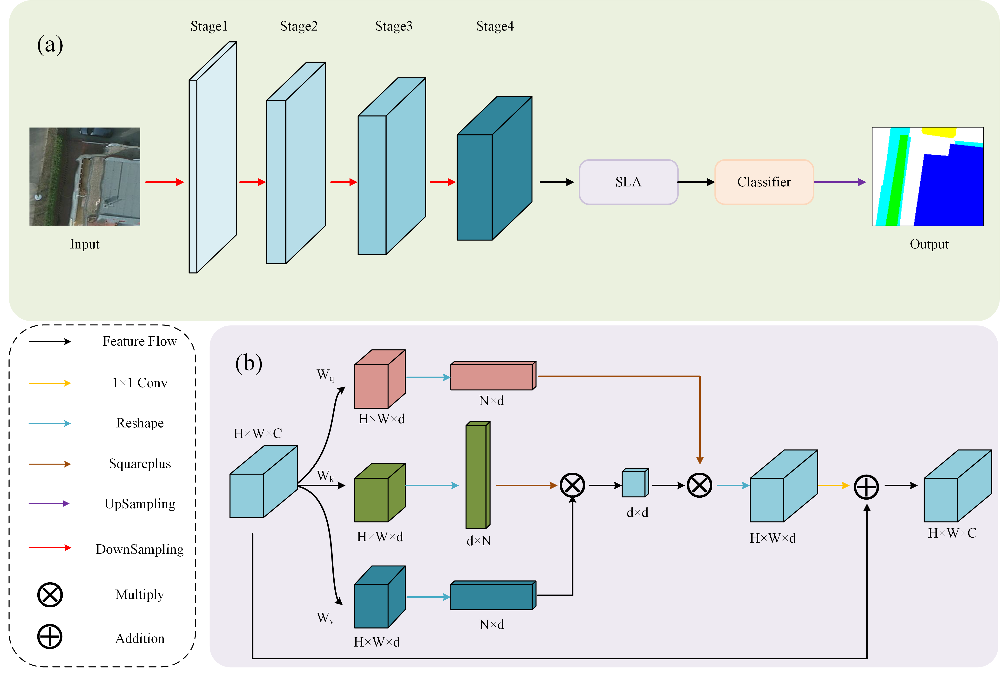
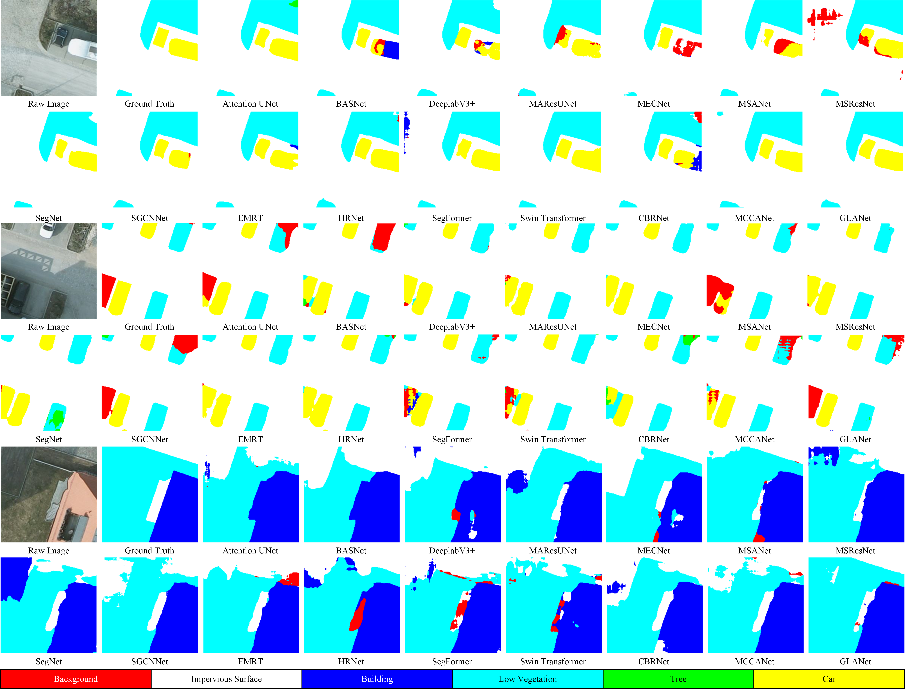
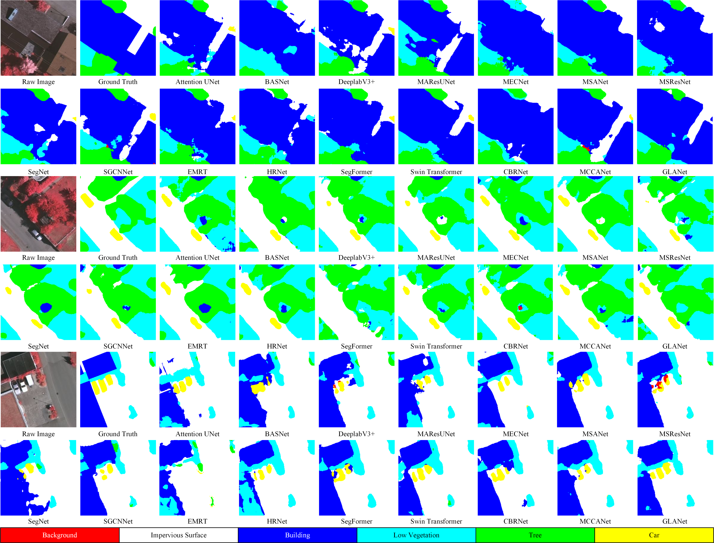

# KBS 2026：A Global Linear Attention Network for Semantic Segmentation of Remote Sensing Images


## Abstract👓

Semantic segmentation of remote sensing images (RSIs) plays a crucial role in various fields, including land cover classification, environment monitoring, and urban planning. Although convolutional neural networks (CNNs) have demonstrated remarkable proficiency in the aforementioned fields, they also face considerable challenges. One such is the inadequate exploration of global dependencies within feature maps, which undermines the feature representations for each semantic category. Furthermore, the prevalent dot-product attention (DPA) in CNNs excels at capturing global semantic details, but suffers from quadratic computation complexity, limiting its practicality for processing large-scale RSIs. To address these challenges, we propose a novel global linear attention network (GLANet), embedding a squareplus linear attention (SLA) module. The SLA module efficiently captures global spatial information and establishes feature relationships by leveraging the associativity of matrix products, drastically reducing the computational load compared to typical DPA by at least 96%, and requiring 12%-26% less computational resources than previous linear attention methods. Extensive experiments validate that GLANet outperformed existing mainstream methods, achieving a mIoU improvement of 0.90% on Potsdam dataset and 0.63% on Vaihingen dataset, respectively. Besides, ablation studies and mathematical analyses further substantiate the efficiency and superiority of the SLA module. The source code will be released at https://github.com/fangyiwei98/GLANet.


## Highlight✨

- To alleviate the computational burden of DPA, a squareplus linear attention (SLA) module is designed. This module leverages the associativity of matrix multiplication to linearly reduce complexity and employs a squareplus kernel function to enhance the representational capacity of the attention mechanism.
- Building on the foundation of the SLA module, we introduce a novel network architecture, GLANet. GLANet capitalizes on the SLA's efficient complexity management and its prowess in capturing global feature dependencies, integrating these advantages into its structural design. Through the deployment of the SLA module, GLANet effectively optimizes the expression of global spatial features, rendering it exceptionally effective for large-scale RSI segmentation tasks..


## Method Overview💡




## Visualization👀
### Visualization on the Potsdam dataset




### Visualization on the Vaihingen dataset


## Usage🧠

### Train ###
python train.py

### Test ###
python test.py

### Datasets ###
All datasets including ISPRS Potsdam, ISPRS Vaihingen, can be downloaded [here](https://www.isprs.org/education/benchmarks/UrbanSemLab/2d-sem-label-potsdam.aspx)


## Results ##

### Results on the Potsdam dataset


| Method | Background | Imp. surf. | Building | Low veg. | Tree | Car | mF1(%) | OA(%) | kappa | mIoU(%) |
|--------|------------|------------|----------|----------|------|-----|--------|-------|-------|---------|
| Attention UNet | 64.68 | 89.24 | 93.80 | 82.70 | 81.03 | 89.46 | 83.49 | 86.61 | 0.82511 | 72.71 |
| BASNet | 60.58 | 89.28 | 93.85 | 82.17 | 79.95 | **89.91** | 82.62 | 86.14 | 0.81899 | 71.75 |
| Deeplabv3+ | 62.07 | 88.79 | 93.45 | 82.73 | 79.74 | 87.69 | 82.41 | 86.10 | 0.81813 | 71.25 |
| MAResUNet | 57.23 | 87.77 | 92.41 | 81.59 | 79.46 | 87.99 | 81.07 | 85.01 | 0.80394 | 69.59 |
| MECNet | 58.85 | 89.05 | 93.81 | 82.68 | 80.70 | 89.61 | 82.45 | 86.31 | 0.82094 | 71.60 |
| MSANet | 54.09 | 88.19 | 92.93 | 81.90 | 79.17 | 87.57 | 80.64 | 85.35 | 0.80760 | 69.25 |
| MSResNet | 52.64 | 87.49 | 92.00 | 80.99 | 79.65 | 88.90 | 80.28 | 84.64 | 0.79885 | 68.82 |
| SegNet | 63.99 | 89.23 | 93.88 | 82.67 | 81.41 | 88.83 | 83.34 | 86.59 | 0.82491 | 72.51 |
| SGCNNet | 65.67 | 89.75 | 94.63 | 83.77 | 81.83 | <u>89.66</u> | 84.22 | 87.35 | 0.83483 | 73.78 |
| EMRT | <u>66.15</u> | 89.24 | 94.50 | 83.31 | 81.68 | 88.31 | 83.80 | 86.81 | 0.82672 | 73.18 |
| HRNet | 64.47 | 88.99 | 94.24 | 83.03 | 81.79 | 88.14 | 83.44 | 86.52 | 0.82461 | 72.64 |
| SegFormer | 56.79 | 87.57 | 93.31 | 80.03 | 81.49 | 87.93 | 82.86 | 86.58 | 0.82519 | 72.00 |
| Swin Transformer | 65.65 | <u>89.79</u> | <u>95.02</u> | <u>84.36</u> | <u>82.43</u> | 88.62 | <u>84.30</u> | <u>87.92</u> | <u>0.83864</u> | <u>73.90</u> |
| CBRNet | 56.79 | 87.57 | 93.31 | 80.39 | 77.87 | 87.14 | 80.51 | 85.29 | 0.80493 | 68.86 |
| MCCANet | 64.89 | 89.77 | 94.85 | 84.20 | 82.26 | 88.45 | 84.07 | 87.18 | 0.82437 | 73.59 |
| **GLANet** | **67.17** | **90.41** | **95.04** | **84.73** | **82.68** | 89.63 | **84.94** | **88.10** | **0.84458** | **74.80** |


### Results on the Potsdam dataset


| Method | Background | Imp. surf. | Building | Low veg. | Tree | Car | mF1(%) | OA(%) | kappa | mIoU(%) |
|--------|------------|------------|----------|----------|------|-----|--------|-------|-------|---------|
| Attention UNet | 75.72 | 86.78 | 90.68 | 75.86 | 84.77 | 53.45 | 77.88 | 84.39 | 0.79346 | 65.20 |
| BASNet | 73.85 | 85.94 | 90.03 | 74.21 | 83.83 | 66.60 | 79.08 | 83.54 | 0.78296 | 66.14 |
| Deeplabv3+ | 72.72 | 84.22 | 87.45 | 69.83 | 81.78 | 45.47 | 73.58 | 80.95 | 0.74799 | 59.97 |
| MAResUNet | 68.84 | 84.87 | 88.99 | 72.01 | 83.26 | 58.77 | 76.12 | 82.39 | 0.76729 | 62.60 |
| MECNet | 79.50 | 86.08 | 89.90 | 73.92 | 83.79 | 56.92 | 78.35 | 83.54 | 0.78236 | 65.62 |
| MSANet | **80.87** | 87.15 | 90.65 | 75.48 | 84.55 | 68.84 | <u>81.26</u> | <u>84.60</u> | <u>0.79659</u> | <u>69.06</u> |
| MSResNet | 68.54 | 86.68 | 90.14 | 73.97 | 84.01 | 58.39 | 76.96 | 83.72 | 0.78482 | 63.84 |
| SegNet | 76.35 | 86.69 | 90.94 | 75.38 | 84.71 | 61.39 | 79.24 | 84.53 | 0.79558 | 66.65 |
| SGCNNet | 71.94 | 85.87 | 89.23 | 73.88 | <u>85.14</u> | 54.24 | 76.72 | 83.59 | 0.78318 | 63.65 |
| EMRT | 78.80 | 85.05 | 89.37 | 73.46 | 80.46 | 67.52 | 79.11 | 83.43 | 0.78462 | 66.02 |
| HRNet | 76.68 | <u>87.57</u> | <u>91.03</u> | <u>76.56</u> | 84.19 | 67.39 | 80.57 | 84.03 | 0.79219 | 68.19 |
| SegFormer | <u>79.66</u> | 86.87 | 90.54 | 75.48 | 81.93 | 64.87 | 79.80 | 83.92 | 0.78670 | 67.29 |
| Swin Transformer | 76.28 | 87.23 | 91.00 | 76.36 | 85.03 | <u>69.73</u> | 80.94 | 84.52 | 0.79429 | 68.63 |
| CBRNet | 78.16 | 82.47 | 90.28 | 71.53 | 81.73 | 68.98 | 78.86 | 83.29 | 0.78490 | 65.67 |
| MCCANet | 77.74 | 84.77 | 88.59 | 75.52 | 84.93 | 63.96 | 79.25 | 84.37 | 0.78230 | 66.37 |
| **GLANet** | 78.95 | **87.59** | **91.35** | **77.00** | **85.55** | **69.79** | **81.70** | **85.43** | **0.80770** | **69.69** |


## Citation

If you use our code for research, please cite this paper: 

```
@article{FANG2026115625,
  title = {A global linear attention network for semantic segmentation of remote sensing images},
  journal = {Knowledge-Based Systems},
  volume = {339},
  pages = {115625},
  year = {2026},
  issn = {0950-7051},
  doi = {https://doi.org/10.1016/j.knosys.2026.115625},
  author = {Yiwei Fang and Chunhua Li and Xin Li and Xin Lyu and Zhennan Xu}
}
```

## Contact

If you encounter any problems or bugs, please don't hesitate to contact me at [yiweifang@hhu.edu.cn](mailto:yiweifang@hhu.edu.cn). 
